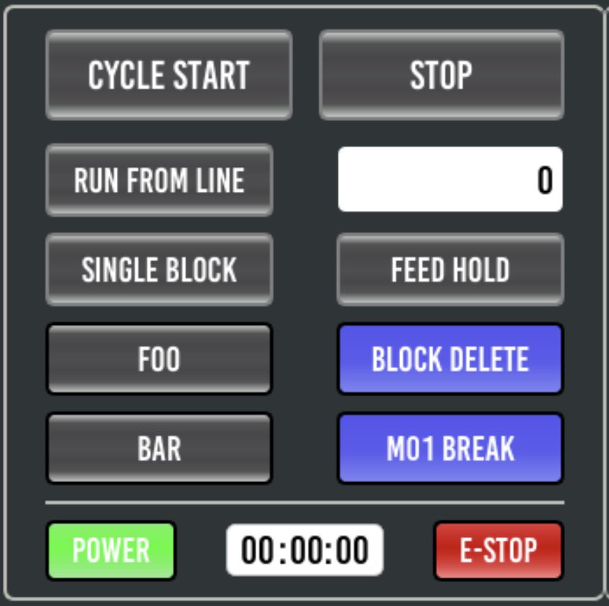

=========================
Customisation with Python
=========================

It is possible to make a simple customisations to the user interface, like renaming a button, by overriding the main window provider in you ``custom_config.yml`` and a simple python class that extends ``ProbeBasic``

These changes can be achieved with the standard instal of Probe Basic, no need for a Development install. Though you may need to dig into the ``probe_basic.ui`` file in Qt Designer to find the needed widget names (``editvcp probe_basic``).

Button Renaming Example
-----------------------

In the following python example the **FLOOD** button is rename to **FOO** and the **MIST** button is renamed to **BAR**



To try out the following yourself, save the python below to a file called ``custom_probebasic.py`` under your machine config directory (``~/linuxcnc/configs/{my_machine}/custom_probebasic.py``).

.. code:: python

    from probe_basic.probe_basic import ProbeBasic

    class CustomProbeBasic(ProbeBasic):
        """Main window class for the ProbeBasic VCP.

        save this file as `custom_probebasic.py` in you configs directory
        then your custom_config.yml add the `provider:` line below to the `mainwidow: section`

        ```
        windows:
          mainwindow:
            provider: custom_probebasic:CustomProbeBasic
            kwargs:
              confirm_exit: false
        ```

        """
        def __init__(self, *args, **kwargs):
            super(CustomProbeBasic, self).__init__(*args, **kwargs)

            # rename the Flood button
            self.flood_button.setText("Foo")

            # rename the Mist button
            self.mist_button.setText("Bar")


Then edit the ``~/linuxcnc/configs/{my_machine}/custom_config.yml`` file and add the line ``provider: custom_probebasic:CustomProbeBasic`` just under ``mainwindow:``

**Before:**

.. code:: yaml

    windows:
      mainwindow:
        kwargs:
          confirm_exit: false

**After:**

.. code:: yaml

    windows:
      mainwindow:
        provider: custom_probebasic:CustomProbeBasic
        kwargs:
          confirm_exit: false

