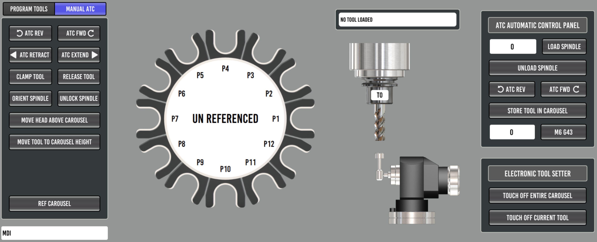

==================
Carousel ATC Setup
==================

TODO: full carousel setup guide. The atc_sim configuration
(``configs/atc_sim``) is a complete working reference in the meantime, and
its README documents the macros and HAL wiring in detail.

Manual Tool Change Fallback
---------------------------

The carousel M6 remap (``toolchange.ngc``) no longer aborts when a tool
change cannot be completed automatically. Instead it parks the carousel,
shows the Probe Basic manual tool change dialog, and waits for the operator
to swap the tool by hand and press resume. This happens when:

- the requested tool is not stored in any carousel pocket (manual load)
- the tool in the spindle has nowhere to go - carousel full (manual removal)
- the tool involved is a manual only tool (manual load and removal)

Tools stored in the carousel are always put away and fetched automatically;
the dialog only appears when a hand swap is unavoidable.

A tool is **manual only** when its ATC column is unchecked in the tool table
editor - intended for oversize tools that physically do not fit between
carousel pockets. This requires the database tool table (the ATC column
lives in the tool database, see :doc:`db_tool_table`); with the classic
``.tbl`` tool table every tool is treated as storable, exactly as before.

The dialog words the prompt for what the operator actually has to do. A
manual **load** shows the familiar "Insert tool" prompt. A manual **removal**
replaces the prompt with a bright red warning naming the cause - the tool is
flagged non storable, or there is no open carousel pocket - because pressing
resume without physically removing the tool would let a later store attempt
crash an oversize tool into the carousel. The dialog also supports an
optional warning icon (a QLabel named ``lblWarnIcon`` in
``toolchange_dialog_pb.ui``), shown only during removals.

INI options ([ATC] section)
^^^^^^^^^^^^^^^^^^^^^^^^^^^

.. code-block:: bash

   [ATC]
   #MANUAL_CHANGE_X = 0.0000
   #MANUAL_CHANGE_Y = 0.0000
   #  Optional position (machine coords) the head moves to for manual tool
   #  changes. BOTH must be set or the head only moves up to the Z
   #  clearance height.

   #DRAWBAR_MONITOR_PIN = motion.digital-in-07
   #  Optional drawbar interlock for manual removals: name a HAL pin or
   #  signal that reflects drawbar actuation (the drawbar button input pin
   #  or the solenoid drive signal) and the dialog resume button stays
   #  DISABLED during a manual tool removal until the drawbar has been
   #  pressed AND released while the dialog is up - physical evidence the
   #  tool actually came out of the spindle. Unset = no interlock.

Drawbar interlock notes
^^^^^^^^^^^^^^^^^^^^^^^

- The pin is read directly from HAL (``hal.get_value``), so no HAL wiring
  changes are needed - any readable pin or signal name works.
- HAL keeps running while the M6 remap is waiting on the dialog, so a
  physical drawbar button wired through HAL works mid-change. UI buttons do
  NOT: MDI and action buttons are blocked while the remap macro is
  executing, and the modal dialog blocks clicks on the rest of the screen.
  This is why the pin should be a physical input or the HAL signal it
  drives.
- Fail-open by design: if the configured name cannot be read, the problem
  is logged and the resume button enables - a typo in the INI must never
  strand the operator mid-change.
- Manual loads are not gated, only removals.
- In the sim configs the commented example points at the unconnected
  ``motion.digital-in-07``, which can be exercised from a second terminal:

  .. code-block:: bash

     halcmd setp motion.digital-in-07 1    # press
     halcmd setp motion.digital-in-07 0    # release -> resume enables

- **Recovery reference:** a manual change waiting on the dialog can always
  be ended from a second terminal, since HAL stays live no matter what the
  interpreter or the GUI are doing. To abort the change entirely (the
  on_abort handler puts the dialog away):

  .. code-block:: bash

     halcmd setp halui.program.abort 1
     halcmd setp halui.program.abort 0

HAL requirements
^^^^^^^^^^^^^^^^

The dialog handshake uses ``motion.digital-out-05`` (request) and
``motion.digital-in-06`` (confirmed), wired to the
``qtpyvcp_manualtoolchange`` component in ``probe_basic_postgui.hal``. ATC
configurations therefore need ``num_dio=8`` on the motmod line (the base
mill instructions use ``num_dio=6``). See ``configs/atc_sim/vmc.hal`` and
``configs/atc_sim/probe_basic_postgui.hal`` for the reference wiring.
