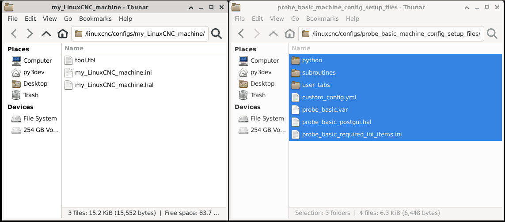
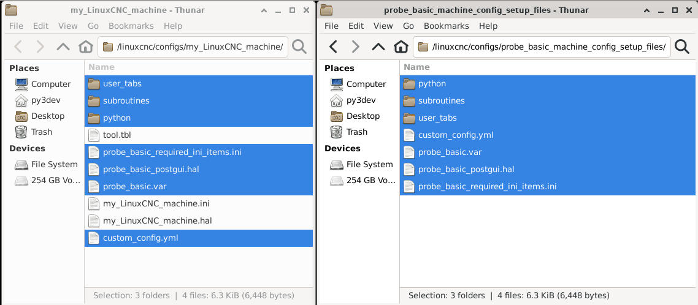
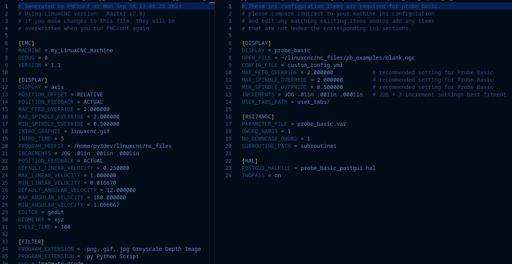
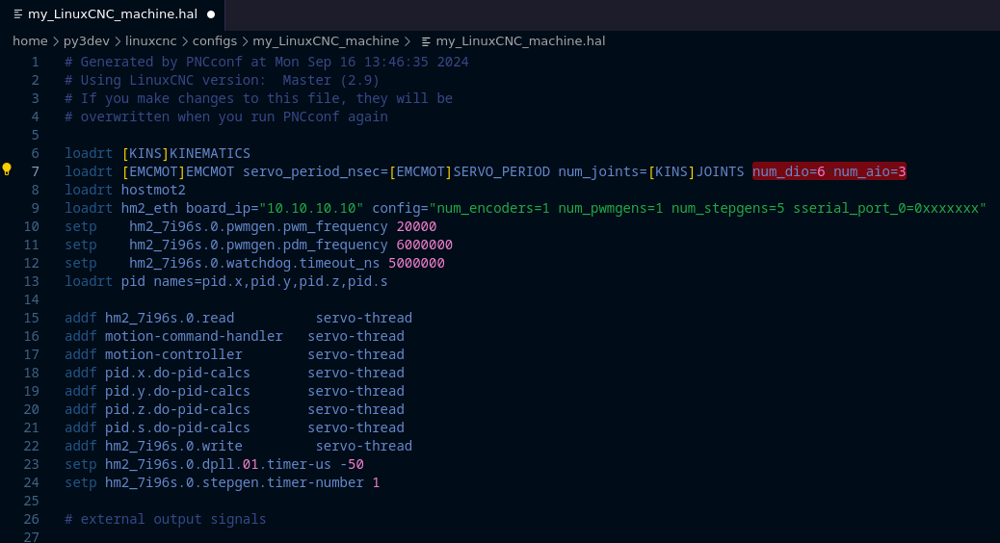

===================================
Machine Configuration (INI, HAL and Supporting Files)
===================================

**Creating a working Machine Configuration for Probe Basic**

Probe Basic uses some different methods to off its feature rich user experience and this unfortunately requires some customized files and settings inside the hal and ini files to allow to function properly.  Below is a guide to help create a working machine configuration for probe basic.  this guide assumes a basic installation with manual tool changes.  a future doc will be available for more complex configurations with ATC and Coolant Cannon functionality.

**Step 1:**

Create a configuration for your machine using Pncconf or mesact/mesact2 from the linuxcnc menu in the applications drop down in the upper menu bar In this example we are using pncconfig.  It is recommended to use the Axis gui display for this initial build.  You should have your machine's wiring schematic premade to make filling in the required information fast, easy and accurate in Pncconf.

After you have completed the Pncconf configuration builder and have created a new machine configuration that has been saved in the linuxcnc config directory, it is advised that you start linuxcnc using your new config to verify there are no errors.  It is also advisable to test the machine to verify the base functionality is correct, for example, jogging, spindle function, axis motion is as expected and the commanded distance matches the actual distance moved, and any other sort any gremlins prior to making the switch to probe basic.  This will ensure when you transition it goes smoothly.  Once completed and found to function correctly, you can proceed to step 2.

**Step 2:**

In the Linuxcnc config folder, there should now be a config folder from the output of Pncconf, there should also be a folder called "probe_basic_machine_config_setup_files".  Both will be used for copying required files over to the new machine config folder.  Open two folder windows on the desktop, the new Pncconf folder created for your machine and the probe_basic_machine_config_setup_files folder. I have shown an example with the stock pncconfig folder contents and a cleaned up version showing which files will be used and which can be discarded for a basic installation.  If you have a special case for having any of these files then please use your discretion for your use case. This guide will assume you will delete the unneeded files as shown below.  Once the folder has been cleaned up, highlight and copy the files shown below from the probe_basic_machine_config_setup_files folder to the Pncconf config folder. What is shown will be the minimum starting point for the config conversion for Probe Basic:

**As built pncconfig folder**

.. image:: images/pb_instruction_1.png
   :align: center

**Unneeded pncconfig files highlighted**

.. image:: images/pb_instruction_2.png
   :align: center

**Cleaned up pncconfig folder**

.. image:: images/pb_instruction_3.png
   :align: center

**Files to be Copied from probe_basic_machine_config_setup_files folder to pncconfig folder**

**Files Copied to pncconfig folder**

**Step 3:**

Now that the files have been copied over its time to edit the ini files.  An ini file has been provided with the basic requirements needed for probe basic to function correctly.

The easiest way to edit them is to use a text editor such as VSCode or similar and open the pncconfig "my_LinuxCNC_machine.ini" file side by side with the supplied "probe_basic_required_ini_items.ini" file.

The "probe_basic_required_ini_items.ini" files shows only the items required by Probe Basic, these lines should be integrated into your existing file.

If a line is present in your machine file, it is recommended to use the probe basic settings for that line.

If a line is not in your machine file in the corresponding ini section, copy the line from "probe_basic_required_ini_items.ini" file to the "my_LinuxCNC_machine.ini" file in its appropriate section.  Once all of these lines have been integrated, edited and/or added, save the file.  It should be noted that only ONE postgui hal file can be called, so any additional items you may want/need for your use case should be added to the existing probe_basic_postgui.hal file. 

Once this task has been completed, You can delete the "probe_basic_required_ini_items.ini" file in the folder as it will not be used.

**Side by Side ini files for editing shown below**

**Step 4:**

Now we will make an addition to the hal file for adding digital and analog IO.  add the highlighted data in red shown in the image below to the end of the following line as shown in the picture:

::

    loadrt [EMCMOT]EMCMOT servo_period_nsec=[EMCMOT]SERVO_PERIOD num_joints=[KINS]JOINTS

Add this: 

::

    num_dio=6 num_aio=3

The finished edit should have the data added to the end like this:

::

    loadrt [EMCMOT]EMCMOT servo_period_nsec=[EMCMOT]SERVO_PERIOD num_joints=[KINS]JOINTSnum_dio=6 num_aio=3

See the below image for verification:

**The second edit is to remove the tool change section show below in the image:**

.. image:: images/pb_instruction_9.png
   :align: center

Be certain to only remove the highlighted section shown. this will allow the correct manual toolchange features in probe basic.

**Now you should be finished and ready to launch probe basic for the first time from your machine**

Under the CNC section of the drop down applications menu, you should find your machine configuration, select it to be launched.  You can select the check box at the bottom of the launch window to create a desktop icon for easier starts after the first time.  We supply an icon image for probe basic that can be set for the newly created desktop lancher. To apply it, right click the desktop launcher and select "edit launcher", click the current icon image and a window will open with system icons, find the icon named "probe_basic_mill" and select it.  Thats it!