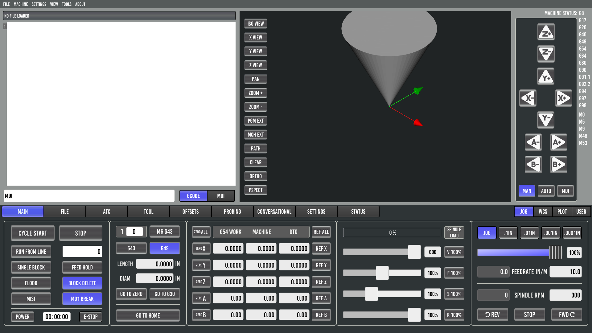
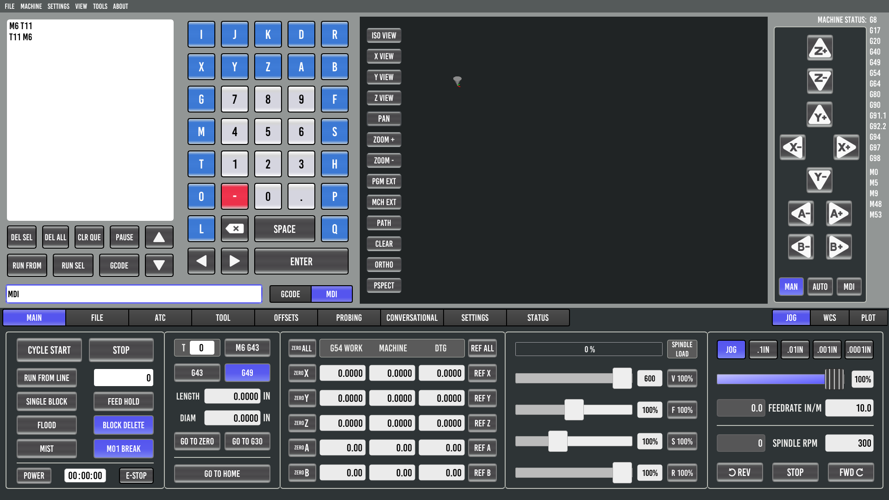
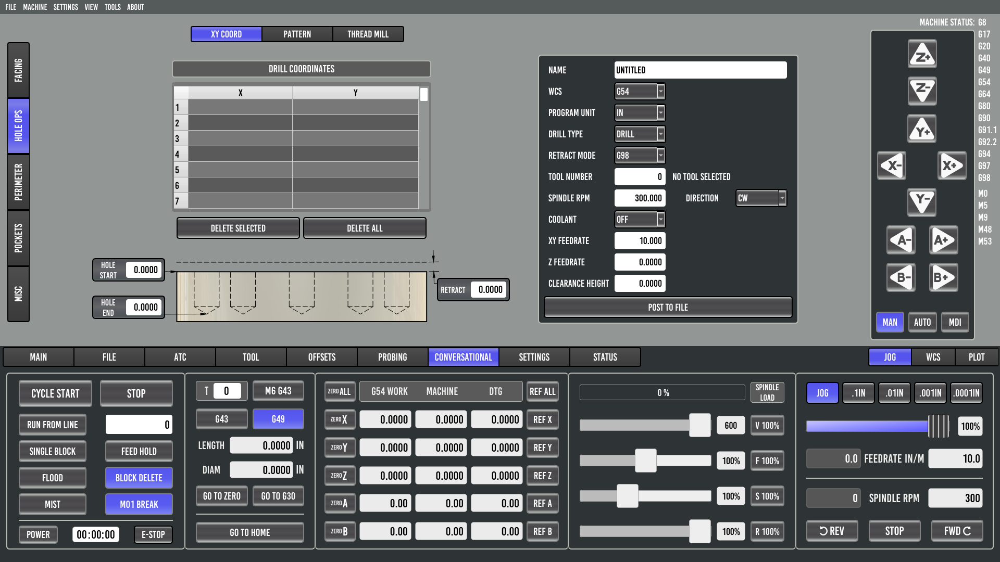
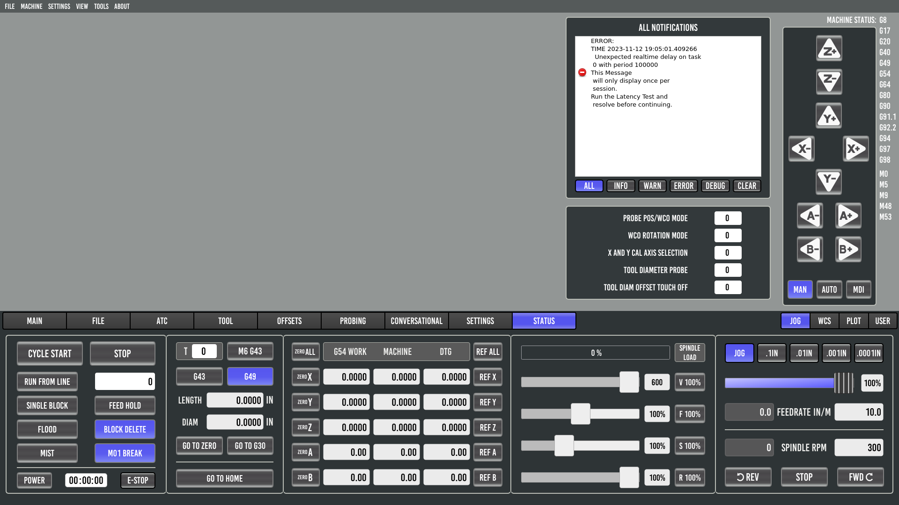

==========================
Probe Basic Mill Interface
==========================

Main
----
GCODE
~~~~~

MDI
~~~

File
----
.. image:: images/mill/02_File.png
   :align: center

ATC
---
.. image:: images/mill/03_ATC.png
   :align: center

Tool
----
.. image:: images/mill/04_Tool.png
   :align: center

Offsets
-------
.. image:: images/mill/05_Offsets.png
   :align: center

Probing
-------
.. image:: images/mill/06_Probing.png
   :align: center

:doc:`Probing Help<probing>`

Conversational
--------------

Facing
~~~~~~
.. image:: images/mill/07_Conversational_Facing.png
   :align: center

Holes
~~~~~

Pattern
^^^^^^^
.. image:: images/mill/07_Conversational_Hole_Ops_Pattern.png
   :align: center

XY Coord
^^^^^^^^

Settings
--------
.. image:: images/mill/08_Settings.png
   :align: center

Status
------

