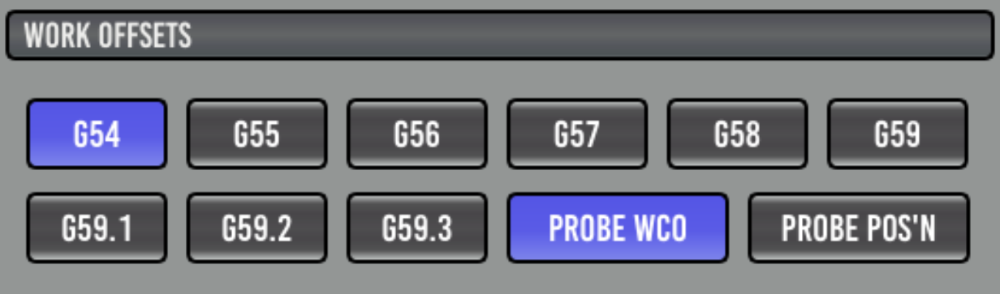
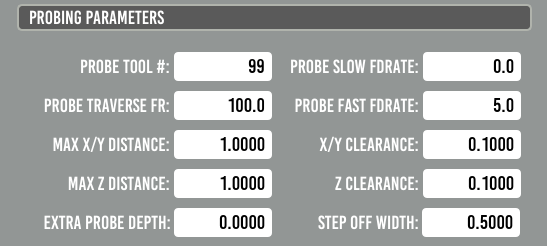
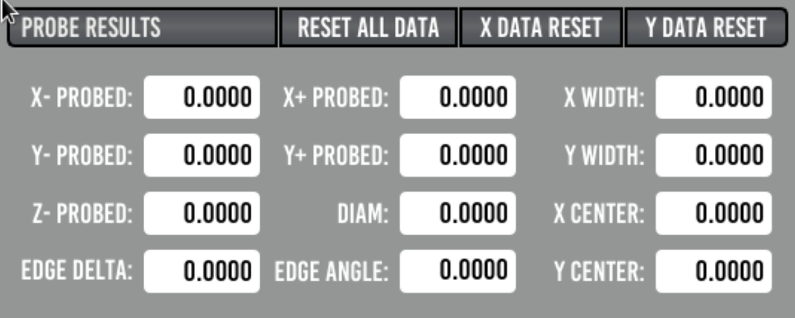
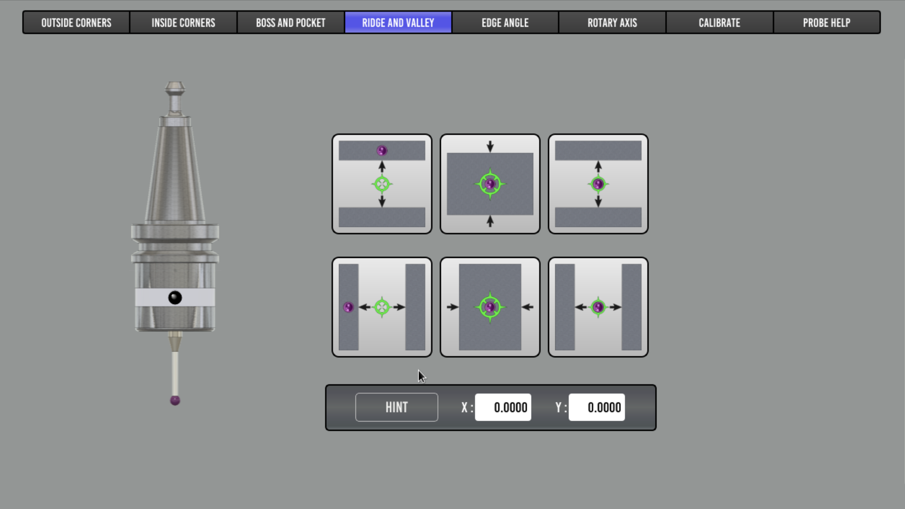
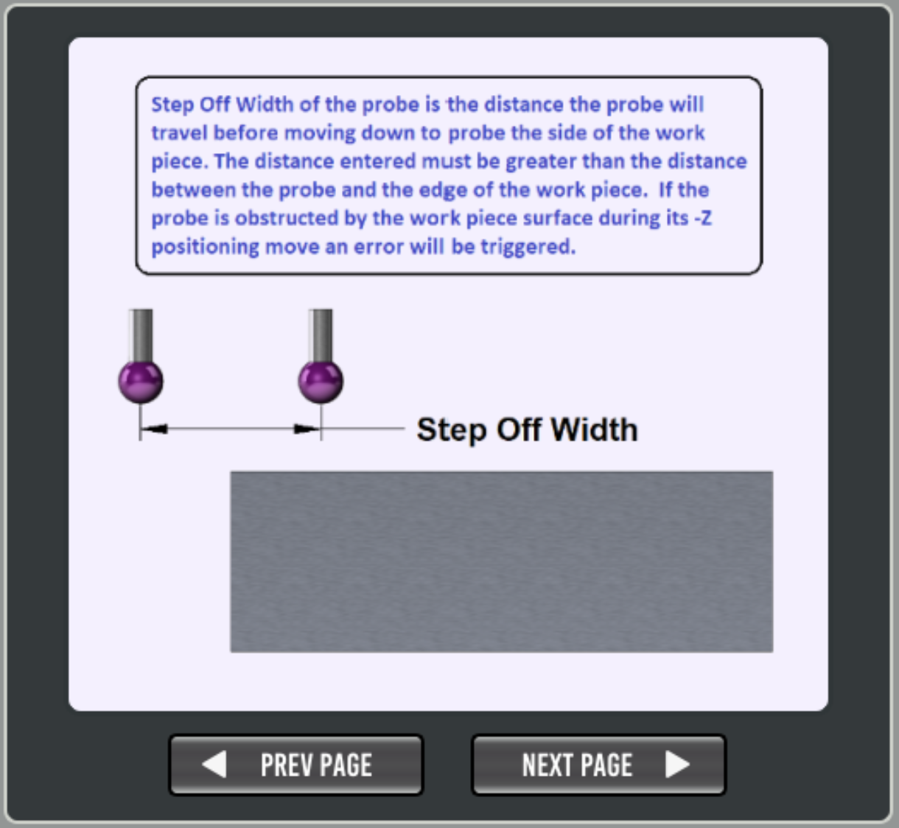
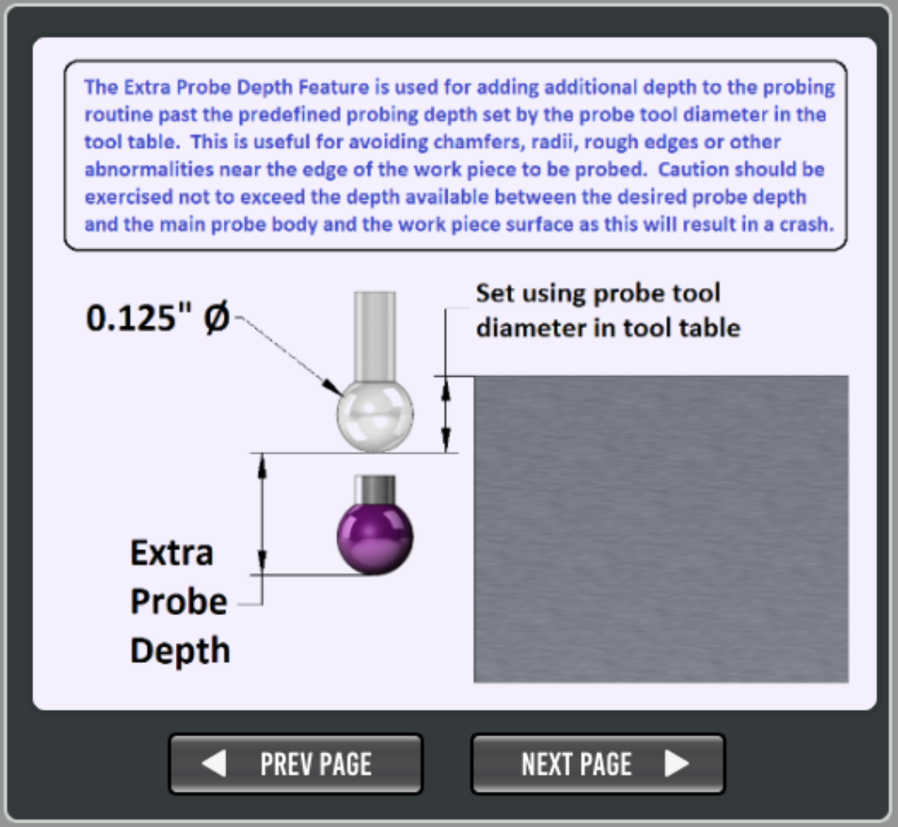

==========================================
Probing
==========================================

Probe Basic has number of include probing routines.

.. image:: images/mill/06_Probing.png
   :align: center

Probing Setup
-------------
To begin probing you fist need to make sure you have connected ``motion.probe-input`` in your HAL file.

Next add an entry in your Tool Table for the probe, including the tip diameter and length offset.

.. note::
   TODO: Document best practice for measuring the probe tools length offset.
   Post by Lcvette suggesting a good method to setup both a probe and tool setter.
   https://forum.linuxcnc.org/qtpyvcp/49102-3d-probe-electric-tool-setter-together-in-pb#271349

There are also a number of probing parameters that need to be populate as well. The :ref:`help <probe_help>` tab include pointers on some of these entries.

Work Offsets
------------

This area allows you to select a Workpiece Coordinate Offsets (WCO) and if it is to be updated as a result of probing.

G5x:
  Set the active Workpiece Coordinate Offset, which maybe updated.
PROBE WCO:
  Update the selected WCO system (G54, G55, etc).
PROBE POS'N:
  Do not update a WCO, just display the results below.

Parameters
----------

PROBE TOOL#:
  This should be set to match the probe entry in you tool table.
STEP OFF WIDTH:
  How far the probe will travel in either X or Y before moving down a side.
PROBE FAST FDRATE:
  Fast feed rate, for first touch when probing.
PROBE SLOW FDRATE:
  Slow feed rate for second touch when probing. If set to 0 (zero) a second touch will not be perform and the result from the fast probe is used.
MAX X/Y DISTANCE:
  Maximum distance to travel in either X or Y before tripping out.
X/Y CLEARANCE:
  Retract distance for X and Y probing after touch, this should be at least larger than any backlash in the axis.
MAX Z DISTANCE:
  Maximum distance to travel in Z before tripping out.
Z CLEARANCE:
  Retract distance for Z probing after touch, this should be at least larger than any backlash in the axis.
EXTRA PROBE DEPTH:
  Extra distance to move down a side (after probe diameter) before probing in X or Y.
EDGE WIDTH:
  Distance between test points when probing for Edge Angle's.

Probe Results
-------------

This shows the results from the last probing run. There are reset button to clear the data if needed.

Probing Routines
----------------
The purple dot in each button shows the position at which your probe tip should be approximately placed before starting the probe run.
The Z height above the work piece should be no more than your "**MAX Z DISTANCE**" parameter.

Outside Corners
~~~~~~~~~~~~~~~
.. image:: images/mill/probe_01_outside_corners.png
   :align: center

Inside Corners
~~~~~~~~~~~~~~~
.. image:: images/mill/probe_02_inside_corners.png
   :align: center

Boss and Pocket
~~~~~~~~~~~~~~~
.. image:: images/mill/probe_03_boss_and_pocket.png
   :align: center

Ridge and Valley
~~~~~~~~~~~~~~~~

Edge Angle
~~~~~~~~~~
.. image:: images/mill/probe_05_edge_angle.png
   :align: center

Rotary Axis
~~~~~~~~~~~
.. image:: images/mill/probe_06_rotary_axis.png
   :align: center

Calibrate
~~~~~~~~~
.. image:: images/mill/probe_07_calibrate.png
   :align: center

As most probes require a small deflection of the tip before tripping, **PROBE CALIBRATION OFFSET** is used to account for this and can be set using these calibration routines and an accurately measured standard gauge.

.. tip::
   Calibration video from Lcvette https://youtu.be/Qr9L6dyXf2A

Help
----
.. _probe_help:
.. image:: images/mill/probe_08_probe_help.png
   :align: center

Included here for offline reference, though a running PB instance may have more up to date help.

.. image:: images/mill/probe_help_03_max_z_distance.png
   :align: center

.. image:: images/mill/probe_help_04_max_xy_distance.png
   :align: center

.. image:: images/mill/probe_help_05_z_clearance.png
   :align: center

.. image:: images/mill/probe_help_06_xz_clearance.png
   :align: center

.. image:: images/mill/probe_help_07_hint.png
   :align: center
