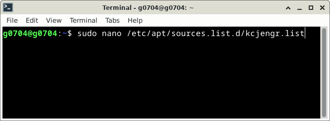
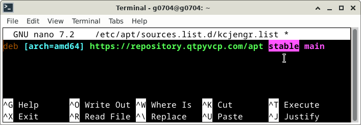
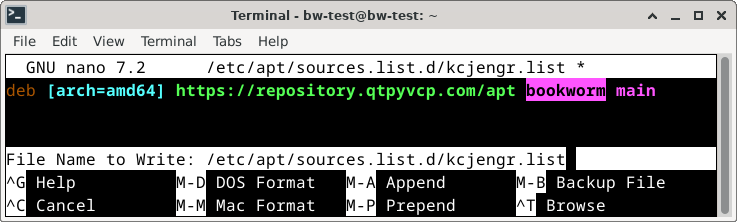

====================================
Changing Stable <-> Develop Versions
====================================

**Probe Basic STABLE and DEVELOP Version Information**

Probe Basic now has a STABLE and a DEVELOP repository from which users can select for apt updates.  You can switch between repositories to test new and upcoming features but must understand that the development repository will be a testing version.  As such it may be subject to bugs.  if you select the develop branch please be sure to report any bugs either on the forum or on git.

Step by Step how to change the sources list name for the stable and develop apt repository:

**1- Type or copy and paste the following line in a terminal, click ENTER, type in your sudo password when prompted, click ENTER.**

::

   sudo nano /etc/apt/sources.list.d/kcjengr.list

|

|

**2- Edit the source list line to set the apt repository for either STABLE or DEVELOP version of Probe Basic as shown below:**

.. image:: images/nano_sources_list.png
   :align: center
   :scale: 80%
|

|

**3- Exit and Save the changes, CTRL + X, Y, ENTER as shown below:**

.. image:: images/yes_nano_to_save.png
   :align: center
   :scale: 80%
|

|

**4- Run uninstall the current installation of Probe Basic with the following commands in terminal:**

::

   sudo dpkg -P python3-probe-basic

|

::

   sudo dpkg -P python3-qtpyvcp

|

**5- Run install of Probe Basic and QtPyVCP with the following commands in terminal:**

::

   sudo apt install python3-qtpyvcp

|

::

   sudo apt install python3-probe-basic

|

**6- Run apt update/upgrade, copy the following in the main terminal one line at a time , select Y for yes if asked at any point during the update**

::

   sudo apt update

::

   sudo apt upgrade

|

**7- NOTE: The development versions will likely require edits, additions or updates to config files, these include but are not limited to the yaml, ini, hal, subroutine, python and any other supporting configuration files.  these changes may not always be fully documents as we test them and are making changes, so we urge users to be aware that the development version should be used in a testing environment only.  Those wishing to retain stability in operational use should change to the STABLE version.**

**Troubleshooting, bug reporting, or general assistance, visit QtPyVCP section of LinuxCNC forum**

https://forum.linuxcnc.org/qtpyvcp

